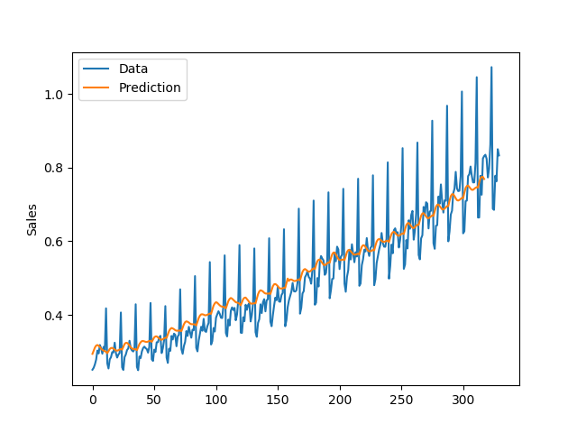
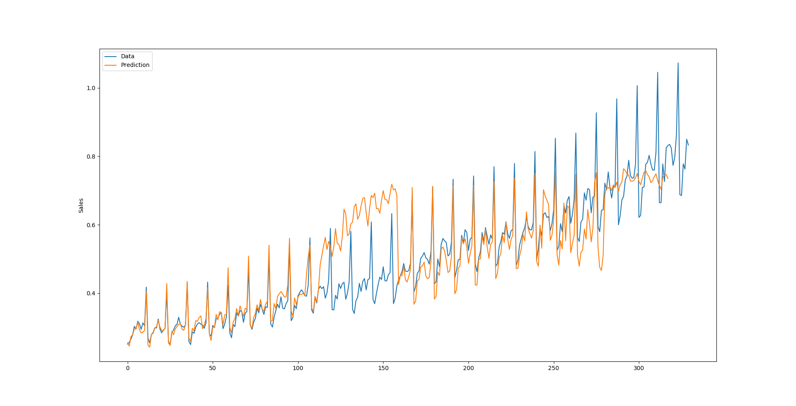

# Sequential Data Analysis
Traditional Fourier analysis has been applied for decades due to their simplicity and usefulness in analyzing the cyclic behavior of the signal. Extending wavelet transform to cope with non-stationary signals. Dictionary based analysis gives up analytical format of bases, allowing for freedom. Machine learning gains much attention of community as it could handle non-linear, complex function. 

On the other hand, random walk model has been developed for year to understand highly stochastic nature of some signal, including the notable stock market.  
## Classical Model
### Autoregressive Model
#### Autocorrelation
#### Partial Autocorrelation

####

#### Wide-Sense Sationary?
## Machine Learning Based Model
### Simple RNN
#### Previous Quarter Data
Good at short-term fluctuation, yet a little off the general trend

#### Method 2
Better at Trend, less adaptive to local features

#### Method 3
Combine Trend Analysis and monthly cycles, yet off a little for some part  
Mean Absolute Error: 0.0058

#### Another Data Set - Sales by Country

